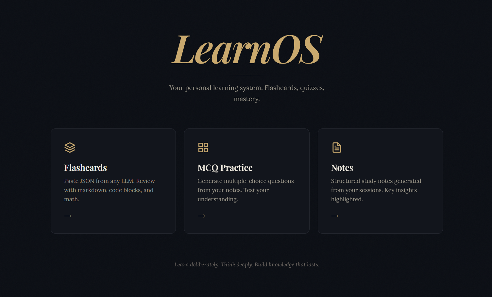

<p align="center">
  <picture>
    <source media="(prefers-color-scheme: dark)">
    
  </picture>
</p>

<p align="center">
  
  
  
  
  
  
</p>

<br />
<h5>LearnOS - my personal learning system</h5>
I learn so much through conversations with LLMs. One thread stays dedicated to the topic, another handles doubts, so the main context stays clean and focused.

Once a session wraps up, learnOS steps in. It provides the prompt (you copy-paste that), the chat used for learning already has the context, and generates really relevant material. The output is structured JSON — rendered as MCQs, flashcards, or short notes, ready to review as needed.

Learning and review, in one loop.



Usage - Just copy the provided prompt, paste in the llm chat used for learning, copy the response json and paste it in learnOS and the generate material, rendered aesthetically - persistent.

---

## Stack

- **React 18** + **TypeScript** — SPA with typed safety
- **Vite** — dev server, HMR, and production bundling
- **Supabase** — PostgreSQL with Row-Level Security, free tier
- **Framer Motion** — declarative animations (card flips, reveals)
- **KaTeX** — server-free LaTeX math rendering
- **highlight.js** — syntax highlighting for code blocks
- **react-router-dom** — client-side routing

## Quick Start

```bash
# 1. Clone and install
git clone https://github.com/PrakharMishra531/learnos.git && cd learnos
npm install

# 2. Set up Supabase
#    Create a free project at https://supabase.com
#    Run the SQL from supabase_schema.sql in the SQL Editor
#    Copy your project URL and anon key

# 3. Create .env file
VITE_SUPABASE_URL=https://your-project.supabase.co
VITE_SUPABASE_ANON_KEY=eyJhbGciOi...

# 4. Run locally
npm run dev        # → http://localhost:5173
```

## Project Structure

```
src/
├── main.tsx              Entry point
├── App.tsx               Router (/, /flashcards, /mcq, /notes, ...)
├── index.css             All styles (1750 lines, single file)
├── lib/
│   ├── supabase.ts       Supabase client init
│   ├── markdown.ts       Markdown renderer (marked + KaTeX + hljs)
│   └── jsonHelper.ts     JSON sanitizer (state machine)
└── components/
    ├── HomePage.tsx       LearnOS landing with nav cards
    ├── FlashcardsPage.tsx Flashcard import + deck list + folders
    ├── DeckViewer.tsx     Card-by-card viewer with flip + nav
    ├── MCQPage.tsx        MCQ import + quiz list + folders
    ├── MCQViewer.tsx      Question-by-question quiz viewer
    ├── NotesPage.tsx      Notes import + note list + folders
    ├── NotesViewer.tsx    Full note reader with download
    └── FolderRow.tsx      Reusable folder accordion with DnD
```

---
- Harness used - opencode + deepseek v4 pro (43M tokens exhausted - 0.6$)
